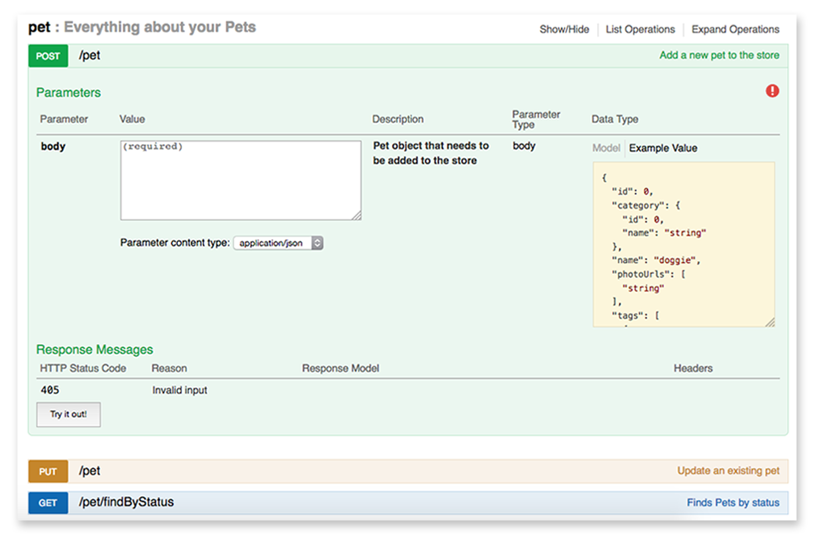
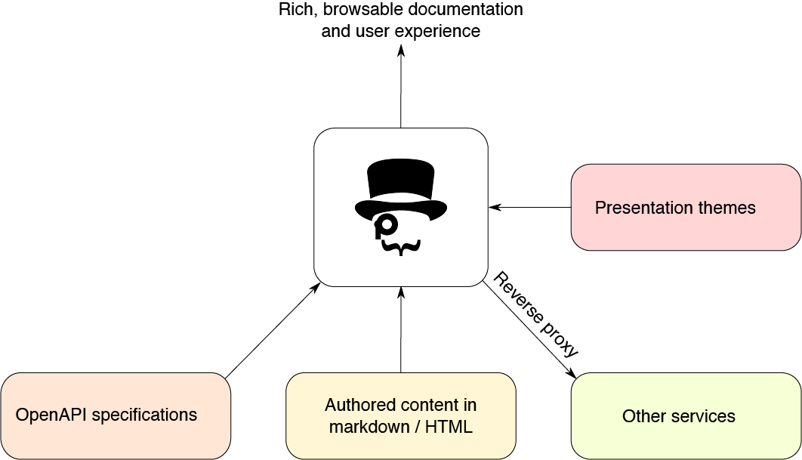
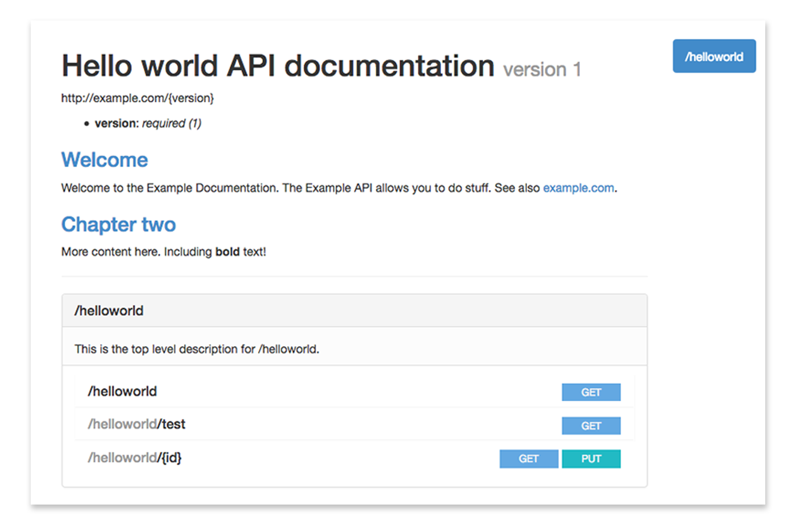
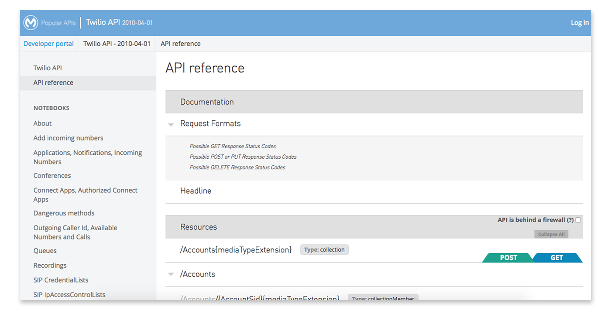
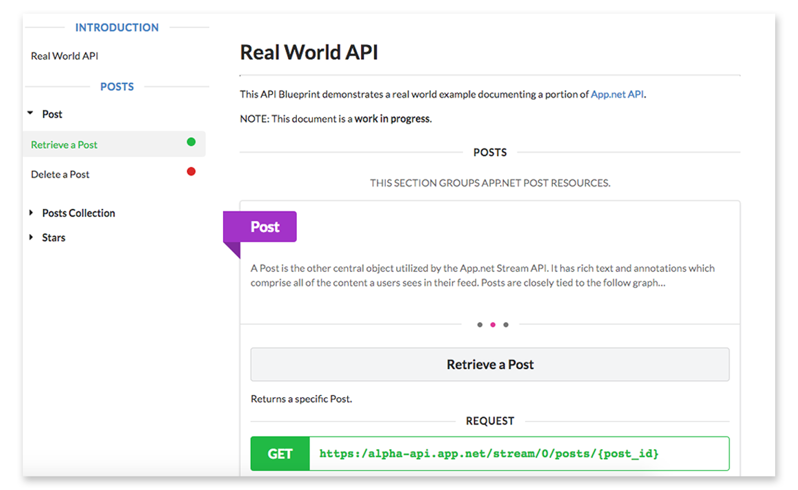
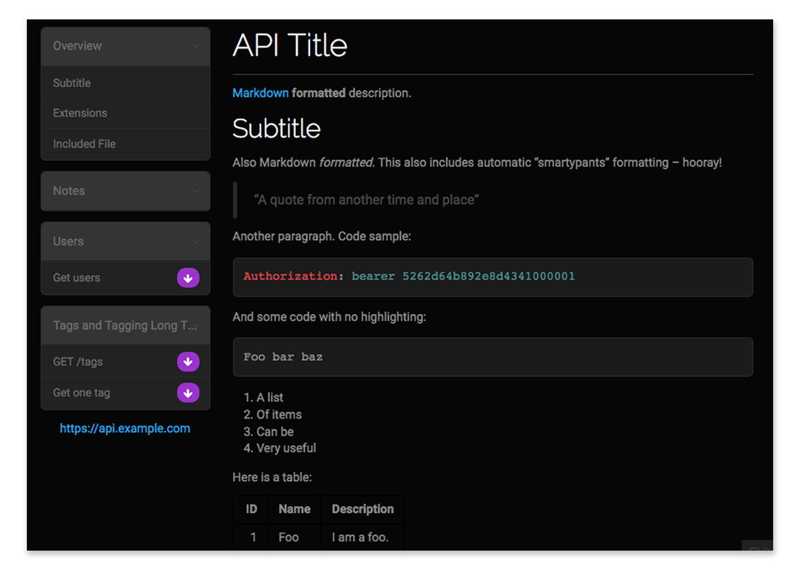



Open source API documentation generators
========================================

API providers describe their API’s functionalities with **specifications and definitions**, like OpenAPI/Swagger, RAML, API Blueprint, I/O Docs or WSDL. **API documentation solutions** convert these definitions into a structured, easy to use API documentation for developers.

*API documentation tools are sometimes named after the type of definition they take, e.g. Swagger generates API documentation from Swagger definitions. They also often include the definition in their naming, e.g. RAML 2 HTML.*

API documentation generators using the Swagger/OpenAPI specification
--------------------------------------------------------------------

The Swagger specification is a powerful definition format that describes RESTful APIs. It maps all the resources and operations associated with a RESTful interface and makes it easier to develop and consume an API.

Recently the Swagger standard changed its name to Open API, you can find out more about the initiative at the [Open API Initiative](https://www.openapis.org/) website. As a leading standard Swagger/OpenAPI has accumulated a large range of API documentation generators that use the specification format.

### Swagger

[Swagger](http://swagger.io/) is a complete framework for describing, producing, consuming, and visualizing RESTful web services.

Use the Swagger ecosystem to create your API documentation: document APIs with JSON using the Swagger spec, and use the Web UI to dynamically convert it into API documentation in a web page. Your API documentation will be displayed through the Swagger UI, which provides a well-structured and good-looking interface.

Example of an API documentation displayed with the Swagger UI

Swagger is free to use, licensed under the [Apache 2.0 License](https://www.apache.org/licenses/LICENSE-2.0). You can find all Swagger-related public tools under the [swagger-api GitHub account](https://github.com/swagger-api).

Many [open source projects](http://swagger.io/open-source-integrations/) and [commercial vendors](http://swagger.io/commercial-tools/) provide Swagger integrations, so make sure to check out the list of available solutions before building new tooling - there is a big chance you will find an existing solution that fits the needs of your project.

As today’s leading API ecosystem, it’s also the best documented and supported. Should you decide to document your APIs with Swagger, you can find plenty of resources, tutorials, examples and help online.

### DapperDox

With [DapperDox](http://dapperdox.io/) you can author readable guides and have them form part of a cohesive set of documentation along with the API specifications: You can inject relevant documentation into the rendered specification page.

To create your API documentation with DapperDox, point DapperDox at your **OpenAPI/Swagger** specifications, add some documentation in **Markdown** and let DapperDox do the rest.

### ReDoc

[ReDoc](https://github.com/Rebilly/ReDoc) uses the OpenAPI specification and generates a responsive site with a three-panel design. It pulls markdown headings from the OpenAPI description field into the side menu, and supports deep linking.

ReDoc aims to make deployment extremely easy, provides a wide support for OpenAPI objects, and offers interactive documentation for nested objects. You can include code samples via a third-party extension.

API documentation generators using the RAML specification
---------------------------------------------------------

[RAML](http://raml.org/) (RESTful API Modeling Language) helps you manage the whole API lifecycle from design to sharing.

RAML is built on broadly-used standards such as YAML and JSON, and is language neutral with tools for: Java, Javascript, .Net, PHP, Python, Ruby, etc.

To create your API documentation with RAML, you can choose open source tools like the [API Console](https://github.com/mulesoft/api-console) or [RAML 2 HTML](https://github.com/raml2html/raml2html). Documentation can be generated quickly and on the fly. With parsers available for many languages you can create your own custom docs and interactive scripts like e.Pages and Spotify.

### RAML 2 HTML

[RAML 2 HTML](https://github.com/raml2html/raml2html) is a simple RAML to HTML documentation generator with theme support, written for Node.js.

Example of an API documentation displayed with RAML 2 HTML’s default theme

RAML 2 HTML ships with a default theme, but you can install more from NPM. For example, to render RAML to Markdown, you can install the raml2html-markdown-theme.

### RAML Api Console

Using the [RAML API Console](https://github.com/mulesoft/api-console) you can create HTML documentation from a RAML specification. It allows browsing of API documentation and in-browser testing of API methods.

There are two ways you can include the console: directly, or within an iframe.

Example of an API documentation displayed with the RAML API Console

API documentation generators using the API Blueprint specification
------------------------------------------------------------------

[API Blueprint](https://apiblueprint.org/) is a Markdown-based document format for writing API descriptions and documentation. With API Blueprint you can quickly design and prototype APIs to be created, or document and test already deployed APIs.

Thanks to its broad adoption there is a wide range of tools built for API Blueprint. From various standalone tools such as mock server, documentation and testing tools to full-featured API life-cycle solutions.

### Snowboard

[Snowboard](https://github.com/subosito/snowboard) is an API Blueprint parser and renderer. It offers a colourful default theme illustrating API request types and responses, and can also be used with custom templates.

Example of an API documentation displayed with Snowboard

### Aglio

[Aglio](https://github.com/danielgtaylor/aglio) renders HTML from API Blueprint files, with support for custom colors, templates and themes.

Example of an API documentation displayed with Aglio (Cyborg two-column theme)

Other free and open source API documentation generators
-------------------------------------------------------

Besides the ones detailed above, there are plenty of different open source API documentation generators for different languages and API specifications. Here’s a brief summary of the ones we’ve explored:

-   [I/O Docs](https://github.com/mashery/iodocs): I/O docs is an API definition format for the TIBCO Mashery network that comes with a live interactive documentation system for RESTful web APIs. By defining APIs at the resource, method and parameter levels in a JSON schema, I/O Docs will generate a JavaScript client interface.
-   [Slate](https://github.com/lord/slate): Slate helps you create responsive API documentation with a clean, intuitive design. Although it’s built in Ruby, when you write docs with Slate, you're just writing Markdown, which makes it simple to edit and understand. By default, your Slate-generated documentation is hosted in a public Github repository, which makes it simple for other developers to make pull requests to your docs if they find typos or other problems. Of course, if you don't want to use GitHub, you can also host your docs elsewhere.
-   [Whiteboard](https://github.com/mpociot/whiteboard): A NodeJS based project started from Slate.
-   [apiDoc](http://apidocjs.com/): Inline documentation for RESTful web APIs, that creates a documentation from API annotations in your source code.
-   [CUUBEZ API Visualizer](http://apivisualizer.cuubez.com/): Java based API solution to visualize the documentation of RESTful web APIs. This API visualizing framework supports all JAXRS based java REST frameworks and non-JAXRS java based REST frameworks that are currently available in the industry.
-   [Apidox](http://apidox.net/): XML powered live interactive API documentation and browsing for RESTful APIs.
-   [Carte](https://github.com/Wiredcraft/carte): A simple Jekyll based documentation website for APIs. Designed as a boilerplate to build your own documentation, heavily inspired by Swagger and I/O docs.
-   [Docbox](https://github.com/tmcw/docbox): A responsive website generated from Markdown documentation content. It’s dynamically updated with React.

And a free one:

-   [API Docs](https://api-docs.io/): Although not open source, API Docs provides a hosted public API documentation service for OAS (Swagger) and RAML specifications for free. Features like custom domains, themes, and analytics, are available for a nominal cost through the [StopLight](http://stoplight.io/?utm_source=apidocs&utm_medium=cost) integration.

General purpose open source documentation tools
===============================================

Although very handy, API documentation generators are not the only way to render and display your API docs. Many general purpose documentation tools can also get the job done. You could consider using them if you already have one in place, or if you have more documentation tasks than documenting your API alone.

A couple of documentation tools you can check out:

-   [Dexy](http://www.dexy.it/): Dexy is a multi-purpose project automation tool with lots of features designed to work with documents. It does the repetitive parts for you, and thus makes it easier to create technical documents. Many developers use it to document APIs, because combined with other open source tools, Dexy is able to run your example code, save the results, fetch data from an API, and post your docs to a blog or a wiki.
-   [Docco](https://jashkenas.github.io/docco/): Docco is a quick-and-dirty documentation generator. It produces an HTML document that displays your comments intermingled with your code.
-   [Doxygen](http://www.stack.nl/~dimitri/doxygen/): Doxygen is the de facto standard tool for generating documentation from annotated C++ sources, but it also supports other popular programming languages such as C, Objective-C, C\#, PHP, Java, Python, IDL, Fortran, VHDL, Tcl, and to some extent D. To document your API, generate an online HTML documentation browser or an offline reference manual, and configure Doxygen to extract the code structure from your source files.

We mentioned these tools to give you an idea of how you can use general documentation tools for API documentation, but there are many more to choose from, if you’d like to follow this approach.

Developer portals
=================

Good API documentation is necessary, but not sufficient for a great developer experience, so it’s better to think about the whole experience in terms of a developer portal that will fulfill all developer needs. Besides the API documentation, a developer portal can include guides and tutorials, reference pages, FAQs, forums, other support resources, software development kits, etc. For an overview of all the different types of documentation a good developer portal needs, [check our blog post series on developer portal components](https://pronovix.com/blog/developer-portals-best-practices-documentation-patterns) or receive it as a white paper in your mailbox by [subscribing to our Developer Portal mailing list](https://bit.ly/devportals).

At Pronovix, we work with [Drupal](https://www.drupal.org/), an open source content management system to build a full-featured developer portal, a toolbox for developer relations with integrated API documentation.

Drupal has a couple of modules that you can use to document your APIs, one of which is the [API module](https://www.drupal.org/project/api) originally developed to produce the Drupal developer documentation available at [api.drupal.org](https://api.drupal.org/api/drupal). It implements a subset of the Doxygen documentation generator specification, with some Drupal-specific additions. If you’d like to publish your API documentation and you plan to extend it into a developer portal, you could give Drupal a try, as it’s free, open source, and has extensive documentation both for the core CMS and the API module.

We have done extensive work with Apigee’s developer portal that is built in Drupal 7, and we are building a new developer portal in Drupal 8, Drupal’s latest release. As API documentation is a key requirement, it will include a custom API documentation generator that can import Swagger/OpenAPI files and that splits the documentation for individual endpoints into separate entities so that you can control access granularly and easily extend your documentation (especially important for partner portals and for organisations that have strong security requirements). Our ultimate goal is to share our developer portal package as an open source Drupal distribution.

Conclusion
==========

As you can see, with some research and hopefully with the help of this post, you have a good chance to find an open source API documentation tool that fits the needs of your project.

Although this article features quite a few solutions, there are many others available or in development, and new ones are popping up continuously. Please let us know in the comments if you’ve tried a solution that you’d recommend to others!

Reference
=========

<table>
<thead>
<tr class="header">
<th></th>
<th>Quick summary</th>
<th>Source (specification)</th>
<th>Live demo</th>
</tr>
</thead>
<tbody>
<tr class="odd">
<td>Swagger</td>
<td>Whole ecosystem, lots of integrations 
Good-looking UI for docs 
Widely used, many resources available</td>
<td>Swagger/OpenAPI</td>
<td><a href="http://petstore.swagger.io/">Swagger demo</a></td>
</tr>
<tr class="even">
<td>DapperDox</td>
<td>Inject relevant documentation right into the rendered specification page</td>
<td>OpenAPI, Markdown</td>
<td><a href="http://dapperdox.io/docs/overview">DapperDox demo</a></td>
</tr>
<tr class="odd">
<td>ReDoc</td>
<td>Easy deployment 
Wide support for OpenAPI objects 
Interactive, responsive documentation</td>
<td>OpenAPI</td>
<td><a href="https://rebilly.github.io/RebillyAPI/">ReDoc demo</a></td>
</tr>
<tr class="even">
<td>RAML 2 HTML</td>
<td>Simple RAML to HTML documentation generator theme support</td>
<td>RAML, NodeJSwith</td>
<td><a href="https://rawgit.com/raml2html/default-theme/master/examples/helloworld.html">RAML 2 HTML demo</a></td>
</tr>
<tr class="odd">
<td>RAML API Console</td>
<td>Browsing of API documentation and in-browser testing of API methods</td>
<td>RAML, NodeJS</td>
<td><a href="https://anypoint.mulesoft.com/apiplatform/popular/#/portals/organizations/52560d3f-c37a-409d-9887-79e0a9a9ecff/apis/5502/versions/5487/pages/30295">RAML API Console demo</a></td>
</tr>
<tr class="even">
<td>Snowboard</td>
<td>API Blueprint renderer</td>
<td>API Blueprint</td>
<td><a href="https://htmlpreview.github.io/?https://github.com/subosito/snowboard/blob/master/examples/alpha/Real%20World%20API.html">Snowboard demo</a></td>
</tr>
<tr class="odd">
<td>Aglio</td>
<td>API Blueprint renderer with many custom themes</td>
<td>API Blueprint</td>
<td><a href="http://htmlpreview.github.io/?https://raw.githubusercontent.com/danielgtaylor/aglio/blob/master/examples/cyborg.html">Aglio demo</a></td>
</tr>
<tr class="even">
<td>I/O Docs</td>
<td>Live interactive API documentation system for I/O Docs specification format</td>
<td>I/O Docs (JSON)</td>
<td><a href="http://support.mashery.com/io-docs">I/O Docs demo</a></td>
</tr>
<tr class="odd">
<td> 
Slate</td>
<td>Clean, intuitive design 
Write in Markdown 
Collaboration through GitHub</td>
<td> 
Markdown (Ruby)</td>
<td> 
<a href="https://lord.github.io/slate/">Slate demo</a></td>
</tr>
<tr class="even">
<td>Whiteboard</td>
<td>NodeJS based Slate alternative</td>
<td>NodeJS</td>
<td><a href="https://wifidistribution.com/docs/">Whiteboard demo</a></td>
</tr>
<tr class="odd">
<td>apiDoc</td>
<td>Inline documentation for RESTful web APIs</td>
<td>NodeJS</td>
<td><a href="http://apidocjs.com/example/">apiDoc demo</a></td>
</tr>
<tr class="even">
<td>CuuBEZ API Visualizer</td>
<td>Visualize the documentation of RESTful web APIs</td>
<td>Java</td>
<td><a href="http://apivisualizerold.cuubez.com/demo.html">CuuBEZ API Visualizer demo</a></td>
</tr>
<tr class="odd">
<td>Apidox</td>
<td>XML powered live interactive API documentation and browsing for RESTful APIs</td>
<td>XML, PHP 
</td>
<td><a href="http://apidox.net/demo/apidox.php">Apidox demo</a></td>
</tr>
<tr class="even">
<td>Carte</td>
<td>A simple Jekyll based documentation website 
for APIs</td>
<td>Jekyll, YAML</td>
<td><a href="http://wiredcraft.github.io/carte/">Carte demo</a></td>
</tr>
<tr class="odd">
<td>Docbox</td>
<td>A responsive website generated from Markdown documentation content</td>
<td>Markdown</td>
<td><a href="https://50-53007065-gh.circle-artifacts.com/0/tmp/circle-artifacts.8SMOD8H/index.html#our-api">Docbox demo</a></td>
</tr>
<tr class="even">
<td>API Docs 
</td>
<td>Free, hosted API documentation</td>
<td>OpenAPI, Swagger, RAML</td>
<td><a href="https://giphy.api-docs.io/1.0/welcome">API Docs demo</a></td>
</tr>
</tbody>
</table>

### Definitions

An **Application Programming Interface (API)** is a set of clearly defined methods of communication between various software components. Organizations share their APIs so that developers can build applications that use the services of their software.

**API documentation** describes what services an API offers and how to use those services. Good quality documentation is essential to developer experience, which in turn will impact the adoption and long-term success of an API.

### We wrote this post for:

-   **API providers**: To provide an overview of free and open source tools for companies that want to share, update or customize their API docs or developer portal.
-   **Developer portal builders**: To provide an independent review of existing developer portal solutions that developer teams tasked with building developer portals can use as a reference in discussions with their clients, to make it easier to select the one that best fits their needs.
-   **Technical writers**: To create a resource that tech writers can use to select the API documentation infrastructure that fits best with their existing authoring workflows.


