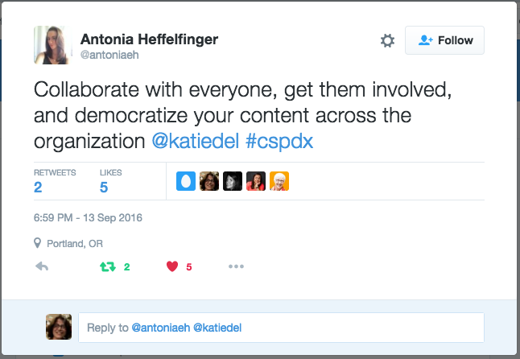

At Rackspace, we recently modernized our customer documentation, implementing a model that treats documents like code.

Known in the tech industry as “docs like code” or “docs as code,” the model provides self-service test, build and web publishing capabilities enabling Rackers and customers to write collaboratively.

The transformation has been a measurable success. The number of contributors has skyrocketed, from 6 to 175, we’ve reduced content build and deployment time from minutes to seconds and eliminated manual review processes by providing web-based staging environments everyone can access.

We now have a modern, responsive user interface with multi-platform support accessible on standard and mobile platforms. We swapped out a custom authoring environment that relied on licensed tools and a specialized support team with open source development tools that can be maintained collaboratively by writing and development teams.

Completing the project took two years. During that time, similar projects at organizations like [Twitter](https://www.youtube.com/watch?v=6y4eQ6gYwdU&index=1&list=PLmV2D6sIiX3UkFCMqq5at0xYgsMqAr6Jf), [Google](https://www.youtube.com/watch?v=EnB8GtPuauw&list=PLmV2D6sIiX3UW1kPWlhzyo4lr6e3US6re&index=14) and the [OpenStack Foundation](https://opensource.com/business/15/4/git-and-github-open-source-documentation-reviews) inspired us.

Each story reflected the unique culture, development environment and goals of the organization, but we found value in the different perspectives, common challenges and cautionary tales that eased our journey.

I want to add another perspective to these stories based on my experience as a senior information developer at Rackspace, and describe how Rackers and customers use the new platform, and the challenges we’ve overcome.

## What is docs like code?

In [Modern Technical Writing](https://www.amazon.com/Modern-Technical-Writing-Introduction-Documentation-ebook/dp/B01A2QL9SS?tag=viglink124746-20), [Andrew Etter](https://www.linkedin.com/in/andrew-etter-0a013349) describes a docs like code model that uses plain text formats and code systems to deliver documentation. Content source is stored in repositories using version control services like GitHub and BitBucket. Another key component is a continuous integration and delivery, or CI/CD system that supports automated web-delivery of content.

A docs like code system enables all teams to contribute content. It simplifies platform development and maintenance by eliminating custom authoring and publishing systems in favor of a unified system for docs and code. Collaboration is easier because everyone works in the same environment.

In a docs like code world, everyone has more time to write. People with technical expertise can write content, which increases the chances that the documentation matches the code and keeps pace with product updates and changes. People with writing expertise can focus on strategic activities like information architecture and content strategy, curation and testing. Most importantly, an effective docs like code implementation enables shared ownership of the content so everyone has a stake in its quality and how effectively it meets customer needs.

## How it’s working at Rackspace

The Rackspace documentation platform delivers to our [Support Network How-To](https://support.rackspace.com/how-to/?_ga=2.229160092.1251205099.1509294907-568023077.1505957457) repository, Carina and [Rackspace developer](https://developer.rackspace.com/docs/?_ga=2.198884143.1251205099.1509294907-568023077.1505957457) websites. Depending on the website, contributors deliver content in [Markdown](https://github.com/adam-p/markdown-here/wiki/Markdown-Cheatsheet#lists) and [reStructuredText](http://docutils.sourceforge.net/rst.html) format.

We use GitHub and GitHub workflow to manage source as well as content development and review. Our [custom-built documentation platform](https://github.com/deconst) assembles documentation from individual GitHub source repositories and publishes it to the web. The platform supports content created using the Jekyll static site generator and Sphinx documentation generator, and can be extended to support other content development frameworks.

Customers can propose changes or submit feedback by using the Edit on GitHub and Submit issue on the documentation user interface.

We also provide instructions, training and templates to enable internal contributions from Rackspace engineering, support and product management, plus external contributions from customers.

Contributors don’t need any special licensing or expensive training. Our platform relies on open source tools and simple workflows.

Under the new documentation model, in addition to the successes I listed above, we standardized writing guidelines and publishing requirements across the support and developer documentation, and simplified and automated writing and publishing processes so writers have more time for higher value activities like content curation, content strategy, quality checking and collaborating more effectively in product planning and development cycles.

Overall, the system enables contributors to produce technical and support documentation fast, collaboratively and with plenty of feedback along the way. Developers can write and review content within the context of their development environment, while writers can collaborate on a multi-functional platform that minimizes manual review and publishing processes.

## How did we get here?

We developed the new documentation system in phases.

First, a collaborative team of managers, engineers, writers, editors, designers and product managers developed the documentation platform and user interface design. Writing teams developed content migration plans in parallel and began migration when the platform stabilized. After that, the writing team worked on enabling contributions.

We developed contributor guidelines, adapted existing Rackspace style and quality guidelines and developed training. The next step was to develop content templates and outreach programs to raise awareness about the new platform.

Getting the work done and gaining adoption required cultural changes that were often more challenging than the mechanics of adopting the new model.

Writers, support representatives and customers unfamiliar with code tools and code workflows had to learn new skills.
Product and support teams accustomed to delegating documentation work to writers had to become more engaged by writing drafts, reviewing content and updating existing content.
Writing teams had to leave behind more sophisticated authoring tools for lighter weight tools with similar features. This meant losing useful functionality like rich semantic tagging and content reuse, and then having to customize the new tools to implement some of those lost features.
Writing teams had to adapt to authoring collaboratively, which requires more coordination, planning and negotiation.
Writing teams took on more responsibility to curate content, define content strategy, mentor contributors, automate quality checking, analyze usage statistics, and report metrics that demonstrate documentation value.
Development and design teams had to mentor contributors on unfamiliar development tools and workflows.
Detailed information about documentation must now be accounted for in requirement definition, release planning, project management tracking and communication workflows, rather than having the writing team manage that work independently.
Like most change initiatives, our documentation transformation is ongoing. We continue to work on training and outreach efforts to increase contribution. We are refining templates and guidelines to simplify contribution. Everyone is learning new skills.

At the organizational level, our leadership team is strengthening partnerships with product management, development, quality, and design teams to develop tighter integration between documentation activities and product planning and development.

## Overcoming challenges

Cultural changes like the Rackspace documentation project require tremendous organizational support. Many people at Rackspace were involved in this project, including the leadership team, writers, editors, developers, designers, support representatives and others. In the beginning, we faced several challenges:

skepticism about leaving our existing DocBook XML-based tool chain behind,
establishing trust to build a collaborative team to develop the new platform,
working across Rackspace writing teams in San Antonio, Austin and Australia had to find the most efficient method to migrate Rackspace Private Cloud documentation, a few thousand support articles and 25 API guides to plain text formats and learn how to architect content using Jekyll and Sphinx.
As with many large projects, people disagreed and actively disliked some project requirements and task assignments.

While these challenges could have easily derailed our project, a major reason we succeeded is the support we got from our leaders, including Jesse Noller, director of engineering; Ian White, our senior manager at project kickoff, and our current senior manager, Laura Clymer.

We also leveraged Rackspace’s close relationship with the OpenStack community. [Anne Gentle](https://justwriteclick.com/) provided expert guidance that continues to inspire our effort to develop a strong, collaborative documentation culture. Another key support was the [Write the Docs community](http://www.writethedocs.org/).

Early on, Rackspace writers attended a Write the Docs conference in Portland. We learned valuable lessons and were motivated by the success of similar projects at other companies. WTD also provided useful information about establishing collaborative relationships across teams and developing the multidisciplinary skills required for collaborative work. The WTD community continues to be a source of guidance and moral support as we navigate continuing challenges.

## Want to learn more?

Are you or your team interested in adopting a docs like code model or improving your documentation development process in general?

The [WTD website](http://www.writethedocs.org/) is a great place to begin, with links to conference presentations, a documentation guide and information about conferences and meet ups.

Considering the docs as code model from different perspectives provides valuable insights about the mechanics of the model as well as cultural and process considerations. Evan Goer provides a developer perspective in [Thinking of Documentation as Code](http://www.slideshare.net/evangoer/yuiconf-2013documentationiscode).

For a perspective that consider both the writer and developer perspective, see [Docs as Code: The Missing Manual](http://www.slideshare.net/MargaretEker/docs-ascodemissingmanual-66429726), a presentation that I co-presented at the Write the Docs 2016 European conference. Our talk focused on optimizing the docs as code model by mapping writing and code workflows to identify gaps and opportunities for additional collaboration and automation, particularly test automation.

At the same conference, [Rachel Whitton’s talk Delivering High-Velocity Docs that Keep Pace with Rapid Release Cycles](http://www.slideshare.net/RachelWhitton3/delivering-highvelocity-docs-that-keep-pace-with-rapid-release-cycles) captured the details of implementing a docs as code model from the writing and operations perspective.

Finally, another great resource is Anne Gentle’s [Docs like Code project](http://docslikecode.com/) that aims to share information and capture best practices for creating documentation collaboratively using code systems.

Are you treating docs like code, or thinking about transforming your documentation processes? We’d love to hear your thoughts and experiences. If you have questions or want to know more about contributing to Rackspace documentation, see our [Contributor Guidelines](http://rackerlabs.github.io/docs-rackspace/contributor-collateral/index.html) or e-mail us at devdoc@rackspace.com.

Originally published November 11, 2016, on the [Rackspace Blog](https://blog.rackspace.com/transforming-developer-and-support-documentation-with-docs-like-code).


