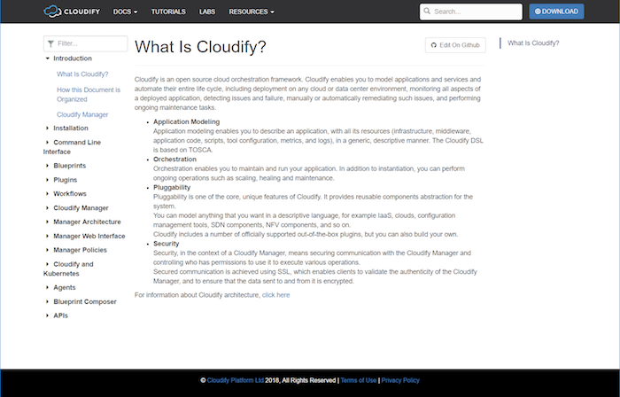
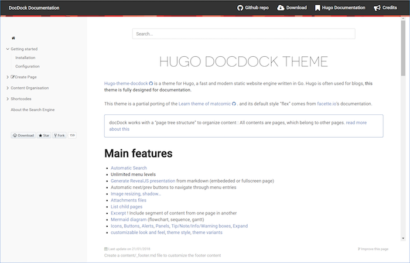
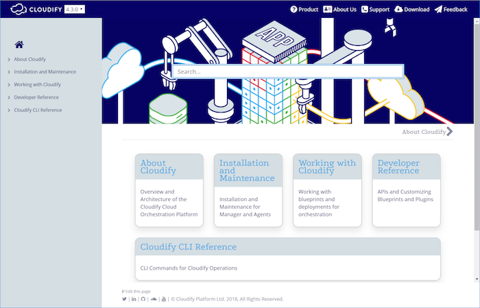

When I signed on as the technical writer at [Cloudify](https://cloudify.co/), I was greeted by the VP of Marketing with, “we need you to join the discussions about the new docs platform.” I was happy that there was a process already started — and especially happy that they didn’t make the decision before I joined.

The existing documentation platform relied on markdown files edited in GitHub and built with a home-glued publishing platform based on the open source, static site generator named Hugo  that everyone felt could fall apart any day.

In my 10 years in documentation I had never used or even heard of such a workflow. Usually writers write in authoring applications that produce the final product. I thought I would do a quick review of the requirements and solutions, and recommend one of the standard documentation tools I was used to. I was the expert, right? I certainly did not expect the discussions to result in an upgrade of the same Hugo platform that also required learning Git, Hugo, CircleCI, CSS, Docker, Bash — and many hours of learning how to put it all together to make *Docs as Code*. But that is exactly what I chose.

So this is the story…

## The Challenge

The first task I received when I arrived at the company seemed simple. “Our sidebar table of contents (TOC) has a long list of top-level categories that are not well organized and confusing to our customers.” Well, sounds easy enough. To get started, we’ll make a hierarchy that simplifies those categories into 5 groups that basically match 5 types of users. Once we get that quick win we can then look at the content in the categories and combine information in the different topics to condense the content into fewer topics. I figured I could have that done in a week with a lot of buffer. My boss said, “Great!”

Now, here are the pitfalls that I met along the way:

 * The content is in one repo and the site configuration, including the TOC definition, is in another.
 * The top-level of the TOC is hard-coded instead of being based on directory structure.
 * All of the versions use the same TOC, so I can’t create a structure that includes newer content.
 * Each commit to git triggers a TravisCI build process that takes up to 5 minutes.
 * There were no internal resources to help me rework the TravisCI configuration because our company mainly worked with CircleCI.
 * With all of the required components, I couldn’t get a local build to work — on Windows, CentOS, or Ubuntu.
 * We were building with Hugo 0.16, but Hugo was now up to 0.36 with many added features and bug fixes.

At the time, the discussions about the new docs platform focused on moving to some of the online services that pull your markdown from GitHub and produce a site from it. One after another I got stuck trying to get them to work with only small hints of success. My mentions of standard tools were met with, “Being an open-source company we should use open-source products. Besides, how would the developers contribute if it’s not in GitHub?” Good points, but I wasn’t finding a way to make it work.

## A Spark of Light

After a few weeks of struggling to learn where everything was and getting nowhere with alternative solutions, it occurred to me that, because the content was in markdown, maybe I could just upgrade to the latest version of Hugo without the added components and build locally? It took a lot of debugging of error messages but I finally got that to work!

Then I looked for a Hugo theme that looked good for documentation and found DocDock. It had a lot of the things that I wanted, including TOC based on directory structure , a main landing page, expanding blocks, single-sourced excerpts, and greatly improved search functionality. When I added the theme to my repo, the site built right away. Great, finally something that worked smoothly! I showed the result to my boss and we agreed that there was a lot of hope here. I told her that I think we could get a fully-functioning POC in a week. Turned out to be a little optimistic.

Some of the challenges that I faced were:

 * The site was not designed to be run from a subdirectory, meaning that the search mysteriously stopped working sometimes.
 * I had to figure out how to make it build in CircleCI with our dev, staging, and production build logic.
 * The site needed the company look-and-feel: header, fonts, and colors.
 * The site needed the dropdown to switch between versions.
 * I still didn’t know how to do any of it.

## Slow Progress

Marketing offered to help with the look-and-feel, but they were really busy with other things so I also dove into the CSS myself. I found out that the colors were specified in 3 different CSS files, so I went through them, with help from marketing, to change to the company color scheme. I switched from local fonts to online fonts based on our company website. The front-end developer in R&D helped me to create the version switching function and I figured out how to add it to the site layout files. The DevOps engineer was busy with R&D tasks but she gave me a few minutes here and there to help me get up to speed enough in git, TravisCI and CircleCI to make slow but positive progress. Of course, periodically I had to rebase and resolve conflicts and errors because, at the same time that I was working on the new structure, developers were still editing and adding content in the old structure.

In short, my determination to get it working and my concern about not having an alternative were my motivations. There were definitely times that I felt it was a lost cause and that I had just wasted the company’s time and money on my gut feeling that this was the right way.

After two (dare I say, long) months things were slowly coming together. I got the automated builds working reliably, found the KB article that resolved the search not working in a subdirectory, and got a little more time with the front-end developer to learn how to troubleshoot CSS issues and get the site to look smooth. I even came up with some little ideas of my own inspired by other knowledge bases and was able to implement those ideas.

## Going Live

Release day arrived. I scheduled it on a Sunday to minimize disruption, of course, but DNS issues with AWS Route53, S3 and Cloudfront caused me to decide to rollback. Also, we didn’t make a plan for the 404 errors customers would see when going to an old link. After some more testing, I decided to go for it again first thing Wednesday morning. Because we are located in Israel, this is still a relatively acceptable time for controlled downtime.

I finally merged the changes from my side-branch into the master branch and things went pretty smoothly. Some tweaks were required but nothing so bad that I needed to rollback again. Unfortunately, a few more days of struggle with redirections of old URLs using AWS S3 only brought frustration. Then, I found that I could add an alias to each page so that Hugo published HTML files at the old URL locations to redirect to the new URLs. I can safely say that was the final step that brought the project to a successful conclusion.

## Success at last!

Two weeks later I saw that unique pageviews on the site were up 50% and exit rates were down. I’m not a statistician but it looked to me like good enough statistics to show that the new site was an improvement over the old site.

As much as I faced lots of frustration during the process, I learned a tremendous amount and the final product was a great improvement, both as a writing process and a content delivery platform. It was a team effort to get it together, and I want to thank everyone for their help:

* Marketing
* R&D
* DevOps
* IT
* Product Management

I hope that others can learn from the process we went through to see that it is both fun and productive to go for your dreams!


