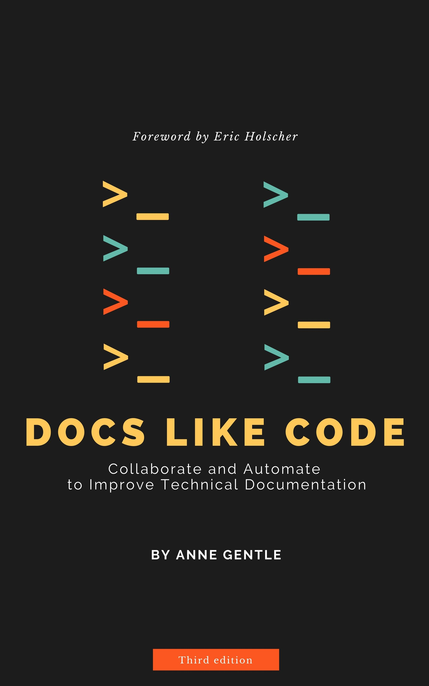

# Learn Docs-as-Code from the Author Who Helped Define It

Transform how your team writes, manages, and publishes documentation using GitHub, Markdown, and automation.

👉 **Stop fighting outdated tools. Start building documentation like software.**

[Buy the Book](#buy-the-book) | [Preview a Sample Chapter](#preview)

---

## What You’ll Learn

- How to use Git and GitHub for documentation workflows  
- Writing and structuring content in Markdown  
- Collaborating with developers using pull requests  
- Automating publishing with CI/CD  
- Scaling documentation across teams and products  

---

## Why This Book Matters

Most documentation teams struggle with:

- Siloed tools and workflows  
- Slow publishing cycles  
- Poor collaboration with engineering  
- Content that quickly becomes outdated  

**Docs Like Code shows you how to fix this.**

By applying software development practices to documentation, you can:

- Ship docs faster  
- Improve accuracy and consistency  
- Collaborate seamlessly with developers  
- Build a sustainable, scalable documentation system  

---

## Who This Book Is For

**This book is for:**
- Technical writers working with engineering teams  
- Developer advocates and API documentation writers  
- Teams adopting docs-as-code workflows  
- Anyone using or evaluating GitHub for documentation  

**This book is not for:**
- Complete beginners with no exposure to Git or Markdown  

---

## What Experts Say

> “A must-read for any technical writer looking to modernize their workflow.”

> “Bridges the gap between writers and developers in a practical, actionable way.”

> “One of the most useful resources on docs-as-code available today.”

---

## About the Author

Anne is a leader in developer documentation and the author of *Docs Like Code*.  
She has worked extensively on API documentation, developer portals, and docs-as-code workflows across major technology organizations.

---

## Preview the Book

Want to see if it’s right for you?

👉 Read the Quick Start Guide and explore the concepts before you buy.

[Docs as Code Quick Start Guide](/learn/000-docs-as-code-quick-start-guide/)

---

## Buy the Book

Get your copy today:

- Print and ebook editions available  
- Ideal for individuals and teams  

👉 **Start improving your documentation workflow today**

[Buy on Lulu](https://www.lulu.com/spotlight/justwriteclick)  
[Buy on Amazon](https://amzn.to/4tiBLy6)

---

## Start Building Better Documentation

If you’re ready to modernize your documentation workflow, this book will give you the foundation.

👉 [Why Buy the Book?](https://docslikecode.com/book/)

## Get Started with Docs as Code

{: style="padding:14px;" height="200" width="319" }

We've transformed the way teams work together on docs, and we want to show you the best practices for writing docs using development tools and techniques. Now available in both print and ebook, check out *Docs Like Code*.

[Buy Now](https://www.lulu.com/spotlight/justwriteclick)

## What's inside?

**Why use GitHub for docs?** If you're unsure of a good fit for your projects and teams, read about the potential wins with these techniques. Or, you may learn how to convince others who need to hear about the use cases.

**Information architecture and workflows, how do you choose?** Read these chapters to find out lessons learned when making sure the users are served first.

**How can I improve upon my team's work?** Author and build content like a pro, whether you're a writer or a developer. Build in quality assurance, automate builds, and review with your teammates to make great docs.

**What are the best practices for REST API docs?** While Swagger/OpenAPI, RAML, and other standards work well when considering the entire API lifecycle, you can also consider collaboration gains with simple markup and narrative documents beyond the REST API reference doc set.

[Buy Now](https://www.lulu.com/spotlight/justwriteclick)

## Who's using these docs-as-code techniques?

> “I met with one of the devs today to go over a Pull Request that I had submitted with editorial comments, and in the course of conversation, I mentioned that I had not been working directly with developers for very long.
>
> He replied that he'd worked with technical editors in the past who were not very helpful, but that I was different. In fact, he assumed I was a developer at first because I was working in GitHub, effortlessly creating PRs!”
>
> _Kelly Holcomb, Senior Technical Editor, Oracle_

> “This book will be the go-to guide for people looking to get into the _Docs like Code_ world. It has been on my list to write for a while, and I'm glad someone did for me. :)”
>
> _Eric Holscher, Cofounder of Read the Docs and Write the Docs_

> "The wonderful @annegentle introduced me to this a long while ago and Docs Like Code has been a huge improvement in /everything/. Check out https://docslikecode.com"
>
> — Cody Bunch

> If you haven’t read about it yet I’d recommend you to read — @annegentle #DocsLikeCode #software #product #Documentation #SaaS #tech #techcomm #technology #technicalwriting #techwriter #knowledgebase
>
> — Sriram Hariharan

> #docsLikeCode refers to the use of repos like #git for source/version control and doc generation. It facilitates #agile docs, in the same sprints as agile dev.
>
> — Mike Jang

> We do this for all documentation at @GDSTeam. The brilliant @annegentle has written a book on 'docs as code' and has case studies and guidance on her website. It works so well!
>
> — Jen Lambourne

> "Docs as Code" is the search term you're looking for! #lca2019 #techcomm #docsascode
>
> — Lana Brindley

> Just finished @annegentle's new book, Docs Like Code — outstanding for devs. If you value quality docs, see the book.
>
> — Carol Willing

> Just finished "Docs Like Code" by @annegentle — Superb advice for modern technical writing.
>
> — Doug Hellmann

> This one just moved to the top of my reading list: a book on how to treat docs like code by @annegentle.
>
> — Patrick Andriessen
